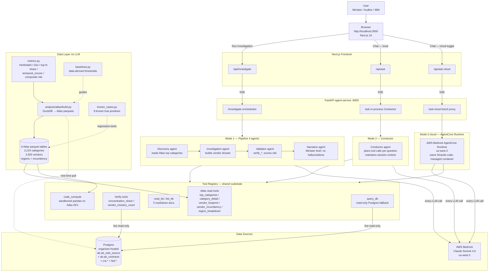

# Architecture diagram — Agency 2026 Procurement Concentration Atlas

System has **two operating modes** sharing a common data + tools substrate.
Mode 1 = structured discovery pipeline (4 specialised agents in sequence).
Mode 2 = adaptive chat (one Conductor agent picks tools per question).

## ASCII diagram (paste into pitch slides / READMEs)

```
                    ┌─────────────────────────────────────────────────────────────┐
                    │                  USER (Minister / Auditor / IBM)            │
                    │           Browser @ http://localhost:3000  (Next.js 16)     │
                    └────────────┬────────────────────────────┬───────────────────┘
                                 │                            │
                  "Run Investigation"                 "Ask anything..."
                                 │                            │
                                 ▼                            ▼
            ┌────────────────────────────┐    ┌──────────────────────────────┐
            │  /api/investigate (SSE)    │    │  /api/ask  OR  /api/ask-cloud │
            │      Next.js route         │    │      Next.js route           │
            └────────────┬───────────────┘    └────────────┬─────────────────┘
                         │                                 │
                         ▼                                 ▼
                ┌──────────────────────────────────────────────────────────────┐
                │           FastAPI agent-service (Python, port 8000)          │
                │  POST /investigate?mode=real    POST /ask    POST /ask-cloud │
                └────┬─────────────────────────┬──────────────────────┬────────┘
                     │                         │                      │
                     │ MODE 1 (pipeline)       │ MODE 2 (chat)        │ MODE 2-cloud
                     ▼                         ▼                      ▼
   ┌─────────────────────────────────┐  ┌──────────────────┐  ┌────────────────────┐
   │   ORCHESTRATOR (Python)         │  │  CONDUCTOR       │  │  AWS BEDROCK       │
   │  agents/orchestrator.py         │  │  agents/         │  │  AGENTCORE         │
   │  run_pipeline() yields SSE      │  │  conductor.py    │  │  RUNTIME           │
   │                                 │  │  (Strands Agent) │  │  us-west-2         │
   │  ┌──────────────────────────┐   │  │                  │  │  (managed)         │
   │  │  1. DISCOVERY agent      │───┤  │  Plans which     │  │                    │
   │  │  reads atlas_categories  │   │  │  tools to call   │  │  Container with    │
   │  │  → top-3 candidates JSON │   │  │  per question.   │  │  same Strands      │
   │  └──────────────────────────┘   │  │  Multi-turn      │  │  agent + tools.    │
   │              │                  │  │  per session.    │  │                    │
   │              ▼                  │  │                  │  │  boto3 invoke_     │
   │  ┌──────────────────────────┐   │  └────────┬─────────┘  │  agent_runtime     │
   │  │  2. INVESTIGATION agent  │   │           │            │  with session id   │
   │  │  builds dossier per      │   │           ▼            │                    │
   │  │  candidate using Atlas   │   │  ╔══════════════════╗  │                    │
   │  └──────────────────────────┘   │  ║   TOOL REGISTRY  ║  │                    │
   │              │                  │  ║   (shared)       ║◄─┤                    │
   │              ▼                  │  ╚══════════════════╝  │                    │
   │  ┌──────────────────────────┐   │           ▲            │                    │
   │  │  3. VALIDATOR agent      │───┼───────────┘            │                    │
   │  │  calls verify_* tools    │   │                        └────────────────────┘
   │  │  against raw SQL,        │   │
   │  │  rules out by-design     │   │
   │  │  singletons, scores      │   │
   │  │  risk 0-100, picks       │   │
   │  │  verdict.                │   │
   │  └──────────────────────────┘   │
   │              │                  │
   │              ▼                  │
   │  ┌──────────────────────────┐   │
   │  │  4. NARRATIVE agent      │   │
   │  │  quantitative-first      │   │
   │  │  Minister briefs.        │   │
   │  │  No fabricated numbers.  │   │
   │  └──────────────────────────┘   │
   │              │                  │
   └──────────────┼──────────────────┘
                  │
                  ▼ (3 ranked Minister briefs with verifications + chart_data)
                  │
           ╔═══════════════════════════════════════════════════════════════╗
           ║                  TOOL REGISTRY (shared substrate)              ║
           ║                                                                ║
           ║  ┌───────────────────────┐  ┌─────────────────────────────┐    ║
           ║  │ ATLAS READ TOOLS      │  │ VERIFY TOOLS                │    ║
           ║  │ (parquet → JSON)      │  │ (live Postgres queries)     │    ║
           ║  │                       │  │                             │    ║
           ║  │ • atlas_top_categories│  │ • verify_concentration_share│    ║
           ║  │ • atlas_category_     │  │ • verify_vendor_ministry_   │    ║
           ║  │     detail            │  │     count                   │    ║
           ║  │ • atlas_vendor_       │  │   (+ legacy v1 tools kept   │    ║
           ║  │     footprint         │  │    for back-compat)         │    ║
           ║  │ • atlas_vendor_       │  └─────────────────────────────┘    ║
           ║  │     incumbency        │                                     ║
           ║  │ • atlas_region_       │  ┌─────────────────────────────┐    ║
           ║  │     breakdown         │  │ KNOWLEDGE / COMPUTE         │    ║
           ║  └───────────────────────┘  │                             │    ║
           ║                             │ • read_kb / list_kb         │    ║
           ║  ┌───────────────────────┐  │   (5 markdown docs)         │    ║
           ║  │ RAW SQL FALLBACK      │  │ • code_compute (sandboxed   │    ║
           ║  │ • query_db (psycopg2  │  │   pandas method-chain on    │    ║
           ║  │   read-only on        │  │   pre-loaded Atlas DFs)     │    ║
           ║  │   ab.* + cra.* +      │  └─────────────────────────────┘    ║
           ║  │   fed.* + general.*)  │                                     ║
           ║  └───────────────────────┘                                     ║
           ╚═══════════════════════════════════════════════════════════════╝
                  │                              │                  │
                  ▼                              ▼                  ▼
           ┌──────────────────────────────────────────────────────────────┐
           │   DATA LAYER  (built once at dev time, no LLM)               │
           │   analysis/atlas/{metrics,build,baselines,known_cases}.py    │
           │                                                              │
           │   Pulls ab.ab_sole_source + ab.ab_contracts (Postgres)       │
           │   into local DuckDB → computes 6 ranked Atlas tables:        │
           │                                                              │
           │   • atlas_categories.parquet         (2,219 rows)            │
           │   • atlas_vendor_dependency.parquet  (2,920 rows)            │
           │   • atlas_incumbency.parquet         (530 rows, 65 step-fn)  │
           │   • atlas_regions_headline.parquet   (124 rows)              │
           │   • atlas_regions_cities.parquet     (572 rows)              │
           │   • atlas_regions_out_of_province.parquet (35 rows)          │
           │                                                              │
           │   Composite Concentration Risk Score (0-100):                │
           │     dollar magnitude  + top-1 dominance                      │
           │     + vendor scarcity + cross-ministry lock-in               │
           │     + multi-year extension flag                              │
           │                                                              │
           │   All thresholds derived from data percentiles, not magic    │
           │   numbers (analysis/atlas/baselines.py).                     │
           └──────────────────────────────────────────────────────────────┘
                                       │
                                       ▼
                      ┌──────────────────────────────────┐
                      │  EVAL HARNESS                    │
                      │  analysis/atlas/known_cases.py   │
                      │                                  │
                      │  pytest-style assertions —       │
                      │  8 known true positives must     │
                      │  surface at risk_score >= 60     │
                      │  (Microsoft Azure 5-yr, IBM x3,  │
                      │  Telus, Alberta Blue Cross,      │
                      │  IBM cross-ministry, Catholic    │
                      │  Social Services).               │
                      │  Runs after every prompt change. │
                      └──────────────────────────────────┘

           ▼ (LLM inference for ALL agents)
   ┌────────────────────────────────────────────┐
   │   AWS BEDROCK  (us-west-2)                 │
   │   us.anthropic.claude-sonnet-4-6           │
   │   Streaming on, temperature 0.3            │
   └────────────────────────────────────────────┘
```

## Mermaid diagram (renders on GitHub + most slide tools)



## Key architectural principles (the discipline behind the diagram)

1. **Data-first.** The data layer pre-computes 6 Atlas parquet tables once at
   dev time. Agents read from those — they do not run analytical SQL on every
   request. This makes the methodology defensible (statistical baselines,
   percentile thresholds derived from the actual distribution, not magic
   numbers) and the agent layer focused on synthesis + reasoning.

2. **Two operating modes share one substrate.** The pipeline (Mode 1) and the
   Conductor chat (Mode 2) consume the SAME tool registry and the SAME Atlas.
   Pipeline = structured systematic discovery without prompting. Chat =
   adaptive reasoning to any judge question.

3. **Validator and eval are different things.**
   - Validator agent (Mode 1, runtime): subjective LLM judgment on one finding,
     calls verify_* tools, picks verdict.
   - Eval harness (analysis/atlas/known_cases.py, dev-time): deterministic
     pytest-style harness that runs the whole system against fixed inputs
     and asserts specific risk-score ranges. Catches regressions.

4. **Two backends for the chat.** Local FastAPI (in-process Conductor) for
   demo speed and reliability. AWS Bedrock AgentCore Runtime (managed
   container) for sponsor-architecture parity. Same Strands code in both;
   only the routing differs.

5. **Hard "no hallucinated numbers" constraint** on the Narrative agent.
   Every number in a Minister brief must trace to a field in the dossier
   (which itself came from Atlas + verify_* calls). Validator downgrades
   verdict if any verify_* failed.
